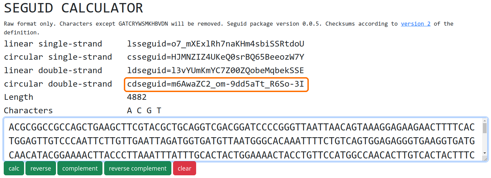

# seguid_calculator

[](https://github.com/BjornFJohansson/seguid_calculator/actions/workflows/test.yml)
[](https://github.com/BjornFJohansson/seguid_calculator/actions/workflows/pyinstaller.yml) [](https://badge.fury.io/py/seguid-calculator)


Seguid_calculator is a GUI for calculating checksums for DNA or RNA sequences.
Four checksums are defined in the table below with their respective use case.

|          | ssDNA        | dsDNA     |
|----------|--------------|-----------|
| linear   | slSEGUID(*)  | dlSEGUID  |
| circular | scSEGUID     | dcSEGUID  |

(*) The slSEGUID checksum is also useful for protein sequences.


## Installation

The quickest way to use seguid_calculator is by downloading one of the apps in the table below, they require
no installation at all.

 Pick the adequate file for your operating system:

| OS                             | File                              |
|--------------------------------|-----------------------------------|
|  | [seguid_calculator.exe]()         |
|    | [seguid_calculator_for_mac.zip]() |
|    | [seguid_calculator]()             |

There is also an online version (see links at the end of this page).

## Source Python installation

Installation from PyPi:

    pip install seguid_calculator

## What does it do ?

The SEGUID checksum was defined as the [base64](https://en.wikipedia.org/wiki/Base64#URL_applications) encoded
[SHA-1](http://en.wikipedia.org/wiki/SHA-1) cryptographic checksum of a
primary biological sequence in uppercase.

SEGUID was suggested by [Babnigg and Giometti ](http://www.ncbi.nlm.nih.gov/pubmed/16858731)
as a stable identifier for cross referencing protein sequences in databases.

Implementations of the SEGUID checksum can be found in BioPython.
[Bio.SeqUtils.CheckSum](http://biopython.org/DIST/docs/api/Bio.SeqUtils.CheckSum-module.html).

For more information, see these [slides](https://www.nature.com/articles/npre.2007.278.1) and the Biopython
[wiki](https://biopython.org/wiki/SeqIO#Using_the_SEGUID_checksum) (scroll down to the "Using the SEGUID checksum" header)
as well as this blog [post](http://wiki.christophchamp.com/index.php/SEGUID).

## slSEGUID


The **s**ingle-strand **l**inear SEGUID or **slSEGUID** is meant for single stranded DNA
or protein sequence which share basic topology, i.e. The sequence has a beginning and an end and only one strand.

slSEGUID is fundamentally a [base64url](https://en.wikipedia.org/wiki/Base64#URL_applications) encoded version
of the original SEGUID checksum where forward slash and plus (`/` , `+`) characters of  the
standard base64 encoding are replaced by `-` and `_`.
This makes the checksum directly useful as a part of a URL.

## scSEGUID


The **s**ingle-strand **c**ircular SEGUID or **scSEGUID** is useful for single-stranded circular DNA sequences and other
molecules sharing the same properties. A circular sequence of this type has no identifiable beginning or end and also no
complementary strand. A real world example of this kind of molecule is the M13 phage that maintains its genome as a circular
single stranded molecule.

As there are many permutations of a circular sequence, using the slSEGUID checksum directly would be impractical as
there could be several checksums for the same sequence. The scSEGUID algorithm first finds
the [lexicographically minimal string rotation](http://en.wikipedia.org/wiki/Lexicographically_minimal_string_rotation)
and then applies the same checksum algorithm as for the slSEGUID.

**N.B.** Plasmids are usually **not** this kind of molecule, see **dcSEGUID** below.


## dlSEGUID


The **d**ouble-strand **l**inear SEGUID or **dlSEGUID** is useful for double-stranded DNA sequences as the one depicted below.
The two representations are equivalent representations of the same DNA molecule.
```
            5'-GATTACA-3'
               |||||||
            3'-CTAATGT-5'

            5'-TGTAATC-3'
               |||||||
            3'-ACATTAG-5'
```

The molecule is made up of two antiparalell complementary strands and has a beginning and an end.
As the strands are complementary, each strand completely identify the other strand in the case of a blunt molecule as the one depicted.

For this reason, most databases only store one of the strands as the other one is easy to infer.
The dlSEGUID algorithm compares two top strands `GATTACA` and `TGTAATC` and chooses the smallest one (`GATTACA`).

A string containing the `GATTACA` string is concatenated with a linebreak character and the reverse of
the complementary strand `GATTACA\nCTAATGT` and further processed as for the slSEGUID checksum.

## dcSEGUID


The dcSEGUID (**d**ouble-strand **c**ircular SEGUID) checksum is defined for circular dsDNA molecules such as
most [plasmids](http://en.wikipedia.org/wiki/Plasmid) and bacterial chromosomes.

The smallest rotation is found for each of the two strands in a manner similar to that of the scSEGUID checksum.
A string in uppercase letters is constructed from the watson sequence starting at its minimum point, a line break and the complementary
sequence in 3'-5' order. Another string is constructed from the crick sequence at its minimum point a line break and a the watson
string in 3'-5' order. The two strings are compared and the checksum is calculated from the string.

The dcSEGUID checksum can be useful to determine if two sequences refer to the same plasmid vector.
The sequence of the plasmid pFA6a-GFPS65T-kanMX6 is available from [Genbank](http://www.ncbi.nlm.nih.gov/nuccore/AJ002682) and
from other sources on the web such as the [Forsburg lab](https://dornsife.usc.edu/pombenet/), sequence [here](https://dornsife.usc.edu/pombenet/vectors/),
a copy of the Forsburg lab sequence was saved [here](https://gist.github.com/BjornFJohansson/d394362134338d5f1ff0).

Both sequences are understood to describe the same vector. The sequences are both, 4882 bp, but the GenBank sequence starts and
ends with `GAAC...TATA` and the Forsburg lab sequence with `ACGC...TAGA`.

The two screenshots below show that the dcSEGUID checksums are identical, which proves that the two sequences describe the same double
stranded circular DNA molecule.

#### Genbank sequence for `pFA6a-GFPS65T-kanMX6`


#### Forsburg lab sequence for `pFA6a-GFPS65T-kanMX6`



## Implementation

Seguid_calculator is written in Python and depends on [wxPython](https://pypi.org/project/wxPython)
and [seguid](https://pypi.org/project/seguid).


## Online version

[](http://seguidcalculator.pythonanywhere.com/)

Click on the image above to take you to the website.
The online version was built with [flask](https://github.com/pallets/flask) and hosted
on [pythonanywhere](https://www.pythonanywhere.com/).


### How to install Online version on pythonanywhere:
```
16:33 ~ $ mkvirtualenv --python=python3.9 MyVirtualenv
created virtual environment CPython3.9.5.final.0-64 in 13108ms
  creator CPython3Posix(dest=/home/seguidcalculator/.virtualenvs/MyVirtualenv, clear=False, no_vcs_ignore=False, global
=False)
  seeder FromAppData(download=False, pip=bundle, setuptools=bundle, wheel=bundle, via=copy, app_data_dir=/home/seguidca
lculator/.local/share/virtualenv)
    added seed packages: pip==21.3, setuptools==58.2.0, wheel==0.37.0
  activators BashActivator,CShellActivator,FishActivator,PowerShellActivator,PythonActivator,XonshActivator
virtualenvwrapper.user_scripts creating /home/seguidcalculator/.virtualenvs/MyVirtualenv/bin/predeactivate
virtualenvwrapper.user_scripts creating /home/seguidcalculator/.virtualenvs/MyVirtualenv/bin/postdeactivate
virtualenvwrapper.user_scripts creating /home/seguidcalculator/.virtualenvs/MyVirtualenv/bin/preactivate
virtualenvwrapper.user_scripts creating /home/seguidcalculator/.virtualenvs/MyVirtualenv/bin/postactivate
virtualenvwrapper.user_scripts creating /home/seguidcalculator/.virtualenvs/MyVirtualenv/bin/get_env_details
(MyVirtualenv) 16:36 ~ $ pip install flask flask-wtf wtforms
Looking in links: /usr/share/pip-wheels
Collecting flask
  Downloading Flask-2.2.2-py3-none-any.whl (101 kB)
     |████████████████████████████████| 101 kB 2.1 MB/s
Collecting flask-wtf
(MyVirtualenv) 16:37 ~ $
(MyVirtualenv) 16:40 ~ $ git checkout https://github.com/BjornFJohansson/seguid_calculator.git
fatal: not a git repository (or any parent up to mount point /home)
Stopping at filesystem boundary (GIT_DISCOVERY_ACROSS_FILESYSTEM not set).
(MyVirtualenv) 16:43 ~ $ git clone https://github.com/BjornFJohansson/seguid_calculator.git
Cloning into 'seguid_calculator'...
remote: Enumerating objects: 1555, done.
remote: Counting objects: 100% (441/441), done.
remote: Compressing objects: 100% (159/159), done.
remote: Total 1555 (delta 236), reused 437 (delta 232), pack-reused 1114
Receiving objects: 100% (1555/1555), 76.46 MiB | 53.41 MiB/s, done.
Resolving deltas: 100% (879/879), done.
Updating files: 100% (48/48), done.
(MyVirtualenv) 16:44 ~ $ ls
README.txt  seguid_calculator
(MyVirtualenv) 16:44 ~ $
```


