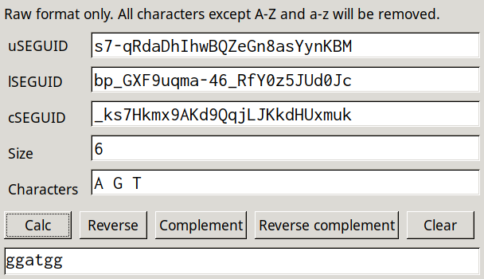

# seguid_calculator

[](https://github.com/BjornFJohansson/seguid_calculator/actions/workflows/build_conda.yml)
[](https://github.com/BjornFJohansson/seguid_calculator/actions/workflows/build_setuptools.yml)
[](https://github.com/BjornFJohansson/seguid_calculator/actions/workflows/test.yml)
[](https://github.com/BjornFJohansson/seguid_calculator/actions/workflows/pyinstaller.yml)



Seguid_calculator is a GUI for calculating the uSEGUID, lSEGUID and cSEGUID checksums for a biological sequence (DNA, RNA or protein).

## Installation

The quickest way to use seguid_calculator is by downloading one of the apps, they requre no installation at all. They are available [here](https://github.com/BjornFJohansson/seguid_calculator/releases/latest). Pick the correct file for your system:

| OS            |         | File                              |
|---------------|---------|-----------------------------------|
|  | Windows | **seguid_calculator.exe**         |
|  | macOS   | **seguid_calculator_for_mac.zip** |
|  | Linux   | **seguid_calculator**             |

No DEB or RPM packages yet. Please let me know if they are needed. These apps and packages are built automatically using Github actions. There is also an online version (see links at the end of this page.

## Source installation

Installation from pypi:

    pip install seguid_calculator

## What does it do ?

The SEGUID checksum is defined as the [base64](https://en.wikipedia.org/wiki/Base64#URL_applications) encoded 
[SHA-1](http://en.wikipedia.org/wiki/SHA-1) cryptographic hash of a 
primary biological sequence in uppercase. SEGUID was suggested by [Babnigg and Giometti ](http://www.ncbi.nlm.nih.gov/pubmed/16858731)
as a way to provide stable identifiers of protein sequences in databases for cross referencing.

There are several implementations of SEGUID calculation available, such as the one in [Biopython](http://biopython.org/wiki/Main_Page).
[Bio.SeqUtils.CheckSum](http://biopython.org/DIST/docs/api/Bio.SeqUtils.CheckSum-module.html).
See [slides](https://www.nature.com/articles/npre.2007.278.1) and the Biopython
[wiki](https://biopython.org/wiki/SeqIO#Using_the_SEGUID_checksum).

See also this blog [post](http://wiki.christophchamp.com/index.php/SEGUID) on the subject.

## uSEGUID

uSEGUID is a [base64url](https://en.wikipedia.org/wiki/Base64#URL_applications) encoded version
of SHA-1 where forward slash and plus ("/" , "+") characters of standard base64 are 
replaced by '-' and '_'. This makes it possible to use the checksum as a part of a URL.

## cSEGUID

Circular uSEGUID or cSEGUID is the uSEGUID checksum for circular (DNA) sequences. As there are many permutations
of a circular sequence, the use of the uSEGUID checksum directly is impractical as there would be many checksums for the
same sequence. The cSEGUID is defined as the SEGUID of the [lexicographically minimal string rotation](http://en.wikipedia.org/wiki/Lexicographically_minimal_string_rotation)
of a sequence or its reverse complement (whichever is lexicographically smaller). The cSEGUID provide a unique and stable identifier for circular sequences, such as [plasmids](http://en.wikipedia.org/wiki/Plasmid).

### Example

The cSEGUID checksum can be useful to quickly determine if two sequences refer to the same plasmid vector.
The sequence of the plasmid pFA6a-GFPS65T-kanMX6 is available from [Genbank](http://www.ncbi.nlm.nih.gov/nuccore/AJ002682)
and from other sources such as the [Forsburg lab](http://www-bcf.usc.edu/~forsburg/), sequence [here](http://www-bcf.usc.edu/~forsburg/GFPS65T.html), a copy of which was saved [here](https://gist.github.com/BjornFJohansson/d394362134338d5f1ff0).

Both sequences are the same size and claim to describe the same vector. Analysis of both sequences in seguid_calculator proves that both sequences are in fact representations of the same sequence by their identical cSEGUIDs:

#### Genbank


#### Forsburg


## lSEGUID

The lSEGUID is the uSEGUID of the lexicographically smallest of the sense or anti-sense strands of a blunt double stranded DNA sequence. This means
that if a sequence and its reverse compliment have the same lSEGUIDs. This can be useful to identify double stranded DNA sequences,
regardless of the form they are presented.

## Implementation

Seguid_calculator is written in python 3 with wxPython 4 which is the only dependence. Development happens on [Github](https://github.com/BjornFJohansson/seguid_calculator).

## Online version

There is also an online version built with [flask](https://github.com/pallets/flask) and hosted on [pythonanywhere](https://www.pythonanywhere.com/).

[](http://seguidcalculator.pythonanywhere.com/)

Click [here](http://seguidcalculator.pythonanywhere.com/) or on the image above to take you to the website.


### How to install on pythonanywhere:
```
16:33 ~ $ mkvirtualenv --python=python3.9 MyVirtualenv                                                                 
created virtual environment CPython3.9.5.final.0-64 in 13108ms                                                         
  creator CPython3Posix(dest=/home/seguidcalculator/.virtualenvs/MyVirtualenv, clear=False, no_vcs_ignore=False, global
=False)                                                                                                                
  seeder FromAppData(download=False, pip=bundle, setuptools=bundle, wheel=bundle, via=copy, app_data_dir=/home/seguidca
lculator/.local/share/virtualenv)                                                                                      
    added seed packages: pip==21.3, setuptools==58.2.0, wheel==0.37.0                                                  
  activators BashActivator,CShellActivator,FishActivator,PowerShellActivator,PythonActivator,XonshActivator            
virtualenvwrapper.user_scripts creating /home/seguidcalculator/.virtualenvs/MyVirtualenv/bin/predeactivate             
virtualenvwrapper.user_scripts creating /home/seguidcalculator/.virtualenvs/MyVirtualenv/bin/postdeactivate            
virtualenvwrapper.user_scripts creating /home/seguidcalculator/.virtualenvs/MyVirtualenv/bin/preactivate               
virtualenvwrapper.user_scripts creating /home/seguidcalculator/.virtualenvs/MyVirtualenv/bin/postactivate              
virtualenvwrapper.user_scripts creating /home/seguidcalculator/.virtualenvs/MyVirtualenv/bin/get_env_details           
(MyVirtualenv) 16:36 ~ $ pip install flask flask-wtf wtforms                                                           
Looking in links: /usr/share/pip-wheels                                                                                
Collecting flask                                                                                                       
  Downloading Flask-2.2.2-py3-none-any.whl (101 kB)                                                                    
     |████████████████████████████████| 101 kB 2.1 MB/s                                                                
Collecting flask-wtf                                                                                                   
(MyVirtualenv) 16:37 ~ $                                                                                               
(MyVirtualenv) 16:40 ~ $ git checkout https://github.com/BjornFJohansson/seguid_calculator.git                         
fatal: not a git repository (or any parent up to mount point /home)                                                    
Stopping at filesystem boundary (GIT_DISCOVERY_ACROSS_FILESYSTEM not set).                                             
(MyVirtualenv) 16:43 ~ $ git clone https://github.com/BjornFJohansson/seguid_calculator.git                            
Cloning into 'seguid_calculator'...                                                                                    
remote: Enumerating objects: 1555, done.
remote: Counting objects: 100% (441/441), done.
remote: Compressing objects: 100% (159/159), done.
remote: Total 1555 (delta 236), reused 437 (delta 232), pack-reused 1114
Receiving objects: 100% (1555/1555), 76.46 MiB | 53.41 MiB/s, done.                                                    
Resolving deltas: 100% (879/879), done.                                                                                
Updating files: 100% (48/48), done.                                                                                    
(MyVirtualenv) 16:44 ~ $ ls                                                                                            
README.txt  seguid_calculator                                                                                          
(MyVirtualenv) 16:44 ~ $
```
        


